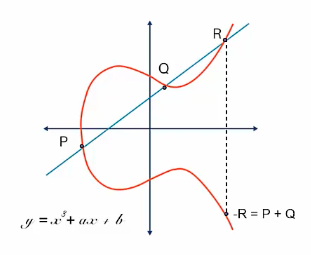
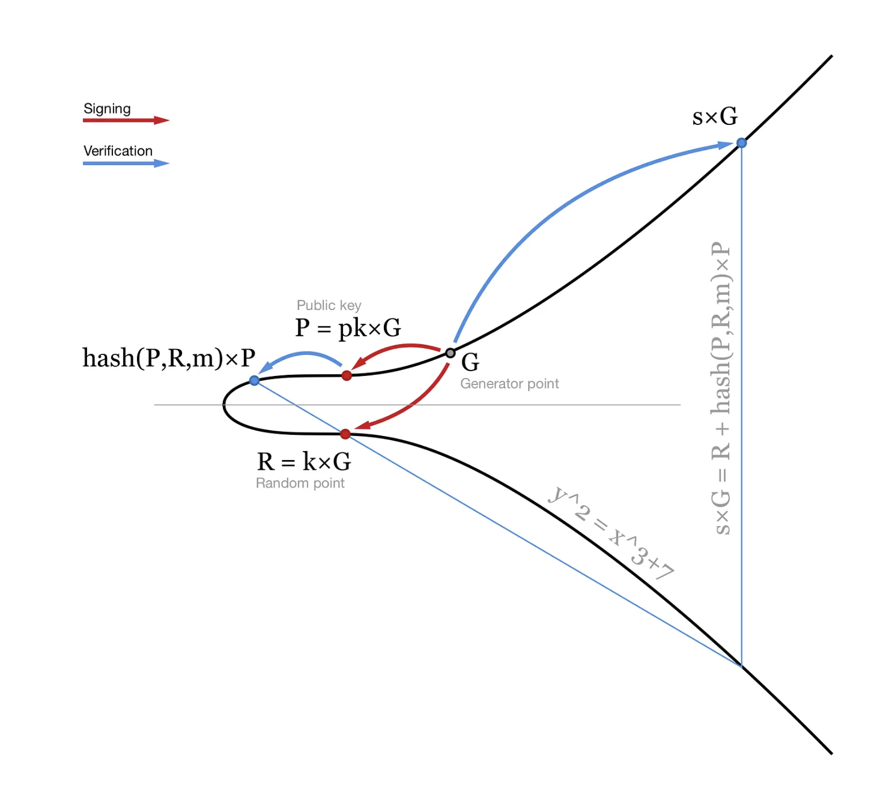

// 요약
슈노르 서명이란? + 장점
이더리움 같이 Secp256k1을 사용하지만, 스마트 컨트랙트에서 사용 가능한 함수는 ECDSA 서명 검증만 지원
이때 사용되는 `ecrecover(m, v, r, s)` 함수를 통해 슈노르 서명 검증 구현 가능

1. 슈노르 서명 알고리즘
2. ECDAS 서명 알고리즘
3. 동치 관계 증명
4. ecrecover(m,v,r,s) 매커니즘 알고리즘
5. 슈노르 서명 파라미터 생성
6. solidity 코드
7. test 코드 실행 명령어

슈노르(이하 Schnorr) 서명은 비트코인과 이더리움에서 사용하는 ECDSA와 같이 타원곡선(Elliptic Curve Cryptography:ECC) 암호학 기반의 디지털 서명 방식중 하나이다. 하지만 다른 디지털 서명에 비해 연산이 간단해 더 빠르게 처리할 수 있으며, 선형성(linearity)을 갖는 알고리즘으로, 멀티서명(multi-signature)과 배치 검증(batch verification) 같은 기능을 지원할 수 있다.

이더리움은 현재 타원곡선 암호학 중 Secp256k1을 사용하며, Schnorr 서명도 이와 호환 가능한 타원곡선이다. 하지만 이더리움은 Pre-Compiled Contract를 통해 스마트 컨트랙트에서 [ECDSA 서명 검증 함수(ecrecover)](https://docs.soliditylang.org/en/latest/cheatsheet.html#mathematical-and-cryptographic-functions)만을 지원한다. 이로 인해 슈노르 서명 검증 기능을 온체인에서 구현하는 데 여러 제약이 따른다. 그러나 [비탈릭 부테린이 제안한 방식](https://ethresear.ch/t/you-can-kinda-abuse-ecrecover-to-do-ecmul-in-secp256k1-today/2384/1)을 활용하면, Solidity에서 제공하는 `ecrecover(m, v, r, s)` 함수를 통해 슈노르 서명 검증에 필요한 기능을 충분히 구현할 수 있다. 

> [!INFO]
> 본 자료는 Solidity의 ecrecover와 keccak256를 활용해 Schnorr 서명을 검증하는 스마트 컨트랙트 [`Schnorr.sol`](contracts/Schnorr.sol) 코드에 대해 리뷰하고, 이를 개발하기 위해 필요한 수학적 개념과 슈노르 서명 알고리즘의 원리도 함께 살펴볼 예정이다.

## 슈노르 서명
### 서명 생성

$$
P_1 = d_1 * G \\
P_2 = d_2 * G
$$

`G`는 seck256k1의 생성점, `d1과 d2`는 개인키, 그리고 `P1과 P2`는 공개키로 정의한다. ECDSA 처럼 하나의 키로 하나의 서명을 생성 할 수 있지만, Schnorr는 두개 이상의 키로 다중 서명(Multi Sig)을 만들 수 있기에, 이 경우 두개 이상의 공개키가 필요하다.

$$
k_1 * G = R_1 \\
k_2 * G = R_2
$$

서명을 생성하는 첫번째 과정으로 `무작위값 k`를 생성하여 `k*G = R값`을 구하는 것으로, 이는 ECDSA와 같다.

$$
R_1 + R_2 = R \\
P_1 + P_2 = P \\
k_1 + k_2 = k \\~\\
e=hash(R,P,m)
$$

각각의 키에서 생성한 변수의 합을 `R, P, k`로 정의하고, 서명하고자 하는 메시지 `m`를 R, P와 같이 해시한 값(Challenge)을 `e`로 정의한다.

$$
s = k + ed \\
s_1 + s_2 = s
$$

그리고, 본인이 소유중인 `개인키 d`와 `e`를 곱한 값에 `본인의 무작위 값 k`를 더하면 서명 값 `s`를 구할 수 있다. R, P와 마찬가지로 두 키가 생성한 s1과 s2를 더한 값을 `s`로 정의한다.

$$
Global~Param: P, G, R, s
$$

이때, `s`, `R`은 서명 값이 되며 최종적으로 서명 검증을 위해 `P`, `G`, `R`, `s` 4가지의 파라미터가 공개되어야 하는 서명 스키마(Signature Schema)가 된다.

### 서명 검증

타원곡선 암호학(ECC)에서, 곡선 상의 두 점 P와 Q를 잇는 직선은 항상 곡선과 한 점 R에서 추가로 교차한다. 그리고 이 점 R에 대해, 두 점의 합 P+Q는 R의 대칭점(곡선에 대해 R을 y축으로 반사한 점)으로 정의된다. 이 성질은 타원곡선 연산의 핵심으로, 덧셈과 스칼라 곱을 가능하게 한다.

 

 

$$
sG = R + eP
$$

이러한 ECC의 성질을 이용하여, 서명 스키마를 타원 곡선상의 점으로 정의하면 위와 같은 공식을 유도할 수 있다. 그리고 해당 공식을 통해 생성된 슈노르 서명을 검증할 수 있다. 두 점 `R`, `eP`의 합의 대칭점을 `sG`로 정의하여, 해당 공식을 풀어 증명해보자

$$

sG = (s_1+s_2)G = (k_1 + ed_1 + k_1 + ed_1)G = (k_1 + k_2)G + e(d_1 + d_2)G \\~\\

\because k_1G + k_2G = R_1 + R_2 = R \\
\therefore (k_1 + k_2)G = R \\~\\

\because (d_1 + d_2)G = P_1 + P_2 = P \\
\therefore e(d_1 + d_2)G = eP \\~\\

\therefore sG = R + eP

$$

## ecrecover(m,v,r,s) 알고리즘
이더리움에서 ECDSA 서명을 검증하는 함수 `ecrecover`는 네 가지 파라미터`(m, v, r, s)`를 입력받는다. 이를 각각 정의하면 다음과 같다: 
- 서명 대상 메시지: `m`
- 무작위 값 `k` * `G`: `R`
- `R`의 x-좌표: `r`
- `r`이 가지는 점의 y-좌표에 대한 대칭성(parity): `v` (= 0 || 1)
- 검증할 서명 값: `s`

$$
s = k^{-1} (m + rd)
$$

ECDSA 서명은 주어진 공식을 통해 서명 값 `s`가 계산된다. 해당 공식에서 `k`는 무작위값, `d`는 서명자의 개인키, `r`은 무작위 점 `R`의 x-좌표로 정의된다. ecrecover는 네 가지 파라미터`(m, v, r, s)`를 아래와 같은 공식으로 서명자의 주소(address)를 구한다.

$$
R = R(r,y)=\begin{cases}
        y>0, if v matches~parity~of~y \\
        y<0, otherwise
        \end{cases} \\
$$

먼저, 파라미터로 전달 받은 r과 v를 통해 점 R을 계산한다.

$$
sk = m+rd \\
skG = mG + rdG \\
sR = mG+rP \\
rP = sR - mG \\
P = r^{-1}(sR - mG) \\ ~ \\

Q = address(keccak256(P))
$$

그리고, s를 구하는 공식을 위와 같이 재정의 하면 서명자의 공개키 `P`를 유도할 수 있다. 최종적으로 공개키를 keccak256로 해시한 값의 마지막 20 bytes를 서명자의 지갑 주소로 return한다.

## Verify schnorr signature with ecrecover(m,v,r,s)
이제 schnorr 서명의 서명 스키마 `P`, `G`, `R`, `s` 4가지의 파라미터 `ecrecover(m,v,r,s)`를 활용하여 검증해볼 예정이다. 먼저, ecrecover의 4가지 파라미터를 schnorr 서명 스키마에서 정의한 값으로 재정의 해보자.
- 공개키 P의 x-좌표: `r`
- 공개키 P의 대칭성(parity = 1 || 0): `v`
- -e * r: `s`
- -s * r: `m`

$$
P = P(r,y)=\begin{cases}
        y>0, if v matches~parity~of~y \\
        y<0, otherwise
        \end{cases} \\~\\
$$

마찬가지로 먼저, 파라미터로 전달 받은 r과 v를 통해 점 P을 계산한다. 이때, P는 서명자들의 공개키를 합한 값($P_1$ + $P_2$ = $P$)이다.

$$\because P = r^{-1}(sR - mG)$$
$$\therefore mG =(-s * r)G$$
$$\therefore sR = (-e * r)P$$

$$ P = r^{-1}(srG - erP) $$
$$ P = sG - eP $$

위에서 설명했던것 처럼 슈노르 서명을 검증하는 공식은 $sG$ = $R$ + $eP$ 이며, 이를 재정의하면 아래와 같다.

$$
R = sG - eP \\  ~ \\
P = sG - eP
$$

최종적으로 return되는 값은 다르지만, 슈노르 서명의 검증 공식은 최종적으로 둘 다 동일한 것을 확인할 수 있다. 이제 프로토콜에서 서명 스키마에서 어떤 값을 검증하는지에 따라 검증하고자 하는 데이터가 달라지며, 아래와 같이 2가지 방법으로 서명 데이터를 검증할 수 있다.

서명 값이 R, s인 경우: 

$$
e = hash(address(R)~||~m) \\
R' = sG - eP \\
check~~R == R'
$$

서명 값이 e, s인 경우:

$$
R = sG - eP \\
e' = hash(address(R)~||~m) \\
check~~e == e' \\
$$

> [!INFO]
> [`Schnorr.sol`](contracts/Schnorr.sol) 코드는 2번째 검증 방법을 구현되었으니, 아래에서 다루는 내용에 대해 참고하자.

## References/notes
- [How Schnorr signatures may improve Bitcoin](https://medium.com/cryptoadvance/how-schnorr-signatures-may-improve-bitcoin-91655bcb4744)
- [코드체인에서의 Schnorr 서명](https://medium.com/codechain-kr/%EC%BD%94%EB%93%9C%EC%B2%B4%EC%9D%B8%EC%97%90%EC%84%9C%EC%9D%98-schnorr-signatures-e32754dccad6)
- [Schnorr signature verification ecrecover hack](https://hackmd.io/@nZ-twauPRISEa6G9zg3XRw/SyjJzSLt9)
- [You can *kinda* abuse ECRECOVER to do ECMUL in secp256k1 today by vbuterin](https://ethresear.ch/t/you-can-kinda-abuse-ecrecover-to-do-ecmul-in-secp256k1-today/2384/5)